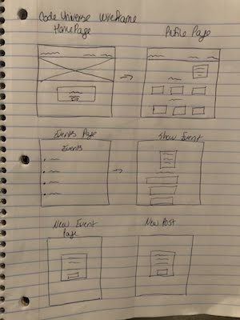
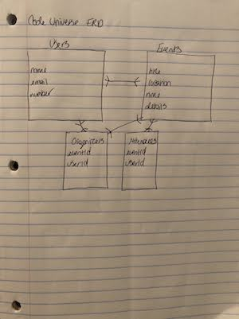

# Code.Universe!
Click to Launch Project:  <https://code-universe.herokuapp.com/>   

Click to view User Story on Trello: <https://trello.com/b/744pwCbd/codeuniverse>

# Project Objective
### Create awesome events for Coders!

# Technologies Used
* Programming Languages - Ruby, Javascript, HTML, CSS,
* Framework: React, Ruby on Rails
* Database: PostgreSQL
* Visual Studio
* iTerm
* User Stories - Trello
* Host & Deploy - Heroku

# App Features
* User Authentication
* Create, Update and Delete Users
* Create and delete Events
* Create Posts
* Splash Page

# Wire Frame

# ERD
